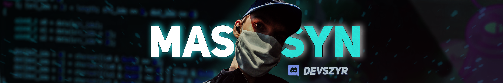

<h1 align="center">Hi 👋, I'm DEVMASSYN</h1>
<h3 align="center">IT student at the Kazimierz Wielki University in Bydgoszcz, Poland</h3>
<h4 align="center">CTO Of SZYRGAMESTUDIO https://github.com/szyrgamestudio</h4>

- 🔭 I’m currently working on [SGSClient](https://github.com/szyrgamestudio/SGSClient)

- 🌱 I’m currently learning **Windows Presentation Foundation, .NET**

- 👨‍💻 All of my projects are available at [https://devmassyn.github.io](https://devmassyn.github.io)

- 📫 How to reach me **devmassyn@outlook.com**

<h3 align="left">Connect with me:</h3>

<h3 align="left">Languages and Tools:</h3>

        

<h3 align="left">Support:</h3>

  
